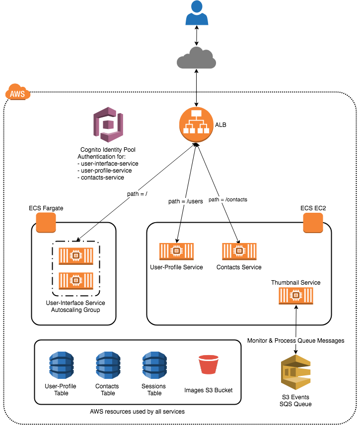

# Deploy and manage Microservices on ECS and Fargate

In this workshop we will deploy a microservices based Contacts Management application on Amazon Elastic Container Service (ECS). We will also a build a CodePipeline for one of the microservices to establish CI/CD Pipeline.

___

## Prerequisites

The following prerequisties must be met before you begin the workshop:

- AWS Console Access
- AWS CLI installed and configured on your Workstation/PC.
- EC2 SSH Key-Pair

___

## Application Overview

___

## Workshop Activities

- [Lab Setup](lab-guides/lab-setup.md)
- [Create ECS Cluster and Container Instances](lab-guides/ecs-cluster-setup.md)
- [Build and deploy Thumbnail-Service](lab-guides/thumbnail-service.md)
- [Build and deploy User-Profile-Service](lab-guides/user-profile-service.md)
- [Build and deploy Contacts-Service](lab-guides/contacts-service.md)
- [Build and deploy User-Interface-Service](lab-guides/user-interface-service.md)
- [Setup auto scaling for User-Interface-Service](lab-guides/auto-scaling.md)
- [Create a CodePipeline for the User-Interface service](lab-guides/codepipeline.md)
- [Clean Up](lab-guides/cleanup.md)

___