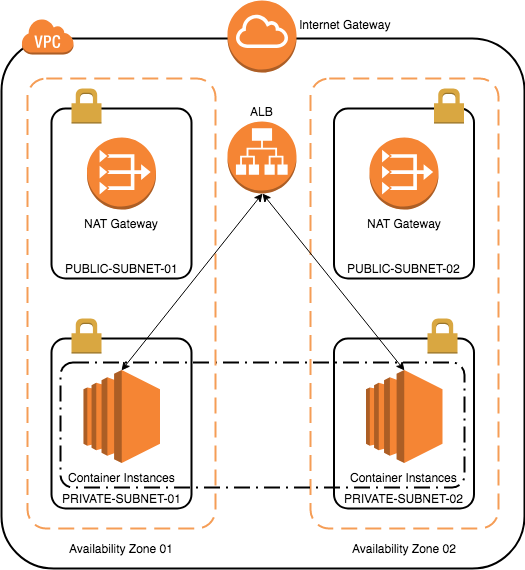

[Back to main guide](../README.md)

___

# Lab Setup

Deploy the CloudFormation template to setup the Lab environment.

```bash
aws cloudformation create-stack \
--stack-name ecs-workshop \
--template-body file://cfn-templates/lab-setup-template.yaml \
--capabilities CAPABILITY_IAM CAPABILITY_NAMED_IAM \
--parameters \
ParameterKey="SshKeyName",ParameterValue="<SSH-KEY-NAME>"

```

**Note** - The CloudFormation stack will try to create a DynamoDB Table named **sessions**. If you already have a DynamoDB table named **sessions** either delete the table or use another AWS Region.

The CloudFormation will create a VPC as illustrated below. The Container Instances will deployed later in the Workshop.

### Network Layout



Login to the AWS Console and navigate to the CloudFormation console. Check the status of the CloudFormation stack that we just created. Once the stack creation is complete, note the Stack Outputs. You can also query Stack output using the below command.

```bash
aws cloudformation describe-stacks --stack-name ecs-workshop --query Stacks[*].Outputs
```

Navigate to the [Cloud9](https://console.aws.amazon.com/cloud9/home) console and open the ECS-Workshop IDE created by the above CloudFormation Template. We will continue to execute the remainder of the workshop from Cloud9 IDE.

### Configuring the Cognito User Pool

The CloudFormtion template created a Cognito User-Pool and a Cognito App client. We will now configure the address of your sign-up and sign-in webpages using the hosted Amazon Cognito domain with your own domain prefix.

1. Create a Cognito User-Pool domain.

```bash
# <SOME-UNIQUE-ID> - e.g. your AWS-Account-Id [or] email-alias, etc.
aws cognito-idp create-user-pool-domain \
--domain <SOME-UNIQUE-ID> \
--user-pool-id <CognitoUserPoolId>
```

2. Change the Cognito Email verification type from **Code** to **Link**.

```bash
aws cognito-idp update-user-pool --user-pool-id <CognitoUserPoolId> \
--auto-verified-attributes "email" \
--verification-message-template \
"{
    \"EmailMessageByLink\": \"Please click the link below to verify your email address. {##Verify Email##}\",
    \"EmailSubjectByLink\": \"Your verification link\",
    \"DefaultEmailOption\": \"CONFIRM_WITH_LINK\"
}"
```

___

[Back to main guide](../README.md)